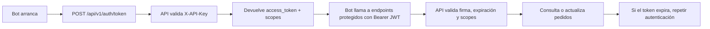

#  API

API que expone una base SQL Server al bot de ventas Itacamba con autenticación por **API Key -> JWT** y control de acceso por **scopes**.

## Qué hace

- Valida una API Key enviada en `X-API-Key`.
- Emite un JWT corto con los permisos del cliente.
- Permite consultar y actualizar pedidos según el scope del token.
- Coordina reservas temporales con Redis para evitar que dos bots tomen el mismo pedido.

## Flujo de uso



## Estructura general

```text
Api-Itacamba/
├─ app/
│  ├─ main.py
│  ├─ api/
│  │  ├─ router.py
│  │  ├─ dependencies.py
│  │  ├─ error_handlers.py
│  │  ├─ endpoints/
│  │  │  ├─ auth.py
│  │  │  └─ pedidos.py
│  │  └─ schemas/
│  ├─ config/
│  ├─ infrastructure/
│  │  ├─ database/
│  │  ├─ cache/
│  │  ├─ coordination/
│  │  └─ security/
│  ├─ services/
│  └─ shared/
├─ docs/
├─ scripts/
├─ tests/
├─ api_clients.json
├─ requirements.txt
└─ README.md
```

## Endpoints principales

| Método | Ruta | Auth | Scope |
|---|---|---|---|
| `POST` | `/api/v1/auth/token` | `X-API-Key` | - |
| `GET` | `/api/v1/auth/me` | `Authorization: Bearer` | - |
| `GET` | `/api/v1/pedidos/pendientes` | `Authorization: Bearer` | `pedidos:read` |
| `POST` | `/api/v1/pedidos/reservar` | `Authorization: Bearer` | `pedidos:reservar` |
| `PATCH` | `/api/v1/pedidos/{pedido_id}/resultado` | `Authorization: Bearer` | `pedidos:cerrar` |

## Seguridad y permisos

La autenticación inicial usa `X-API-Key`. Si la clave es válida, la API devuelve un JWT firmado con `HS256`. Ese JWT incluye los scopes del cliente y se usa para autorizar cada operación.

Scopes vigentes:

- `pedidos:read`
- `pedidos:reservar`
- `pedidos:cerrar`
- `*` para acceso administrador

## Clientes API

Cada cliente se define en `api_clients.json`.

```json
[
  {
    "id": "bot_itacamba_v3",
    "api_key_hash": "<sha256>",
    "scopes": ["pedidos:read", "pedidos:reservar", "pedidos:cerrar"],
    "active": true,
    "description": "Bot principal de ventas"
  }
]
```

Para generar una nueva API Key y su hash:

```bash
python scripts/generate_api_key_hash.py
```

## Variables de entorno

| Variable | Obligatoria | Valor por defecto |
|---|---|---|
| `APP_NAME` | No | `ItacambaAPI` |
| `APP_ENV` | No | `development` |
| `DEBUG` | No | `false` |
| `API_PREFIX` | No | `/api/v1` |
| `DATABASE_URL` | Sí | - |
| `DB_ECHO` | No | `false` |
| `DB_POOL_SIZE` | No | `5` |
| `DB_MAX_OVERFLOW` | No | `10` |
| `JWT_SECRET` | Sí | - |
| `JWT_ALGORITHM` | No | `HS256` |
| `JWT_EXPIRE_MINUTES` | No | `30` |
| `JWT_ISSUER` | No | `itacamba-api` |
| `API_CLIENTS_FILE` | No | `api_clients.json` |
| `CORS_ORIGINS` | No | `*` |

## Errores comunes

| Código | Significado | Causa típica |
|---|---|---|
| `401` | Unauthorized | API Key inválida, JWT ausente o expirado |
| `403` | Forbidden | El token no tiene el scope requerido |
| `404` | Not Found | El recurso solicitado no existe |
| `422` | Unprocessable Entity | La petición no cumple el esquema esperado |
| `429` | Too Many Requests | Se superó el rate limit |
| `500` | Internal Server Error | Error no controlado en la aplicación |

## Documentación ampliada

La documentación detallada de comportamiento, reservas, Redis y reglas de negocio está en [docs/DOCUMENTACION_API.md](docs/DOCUMENTACION_API.md).
